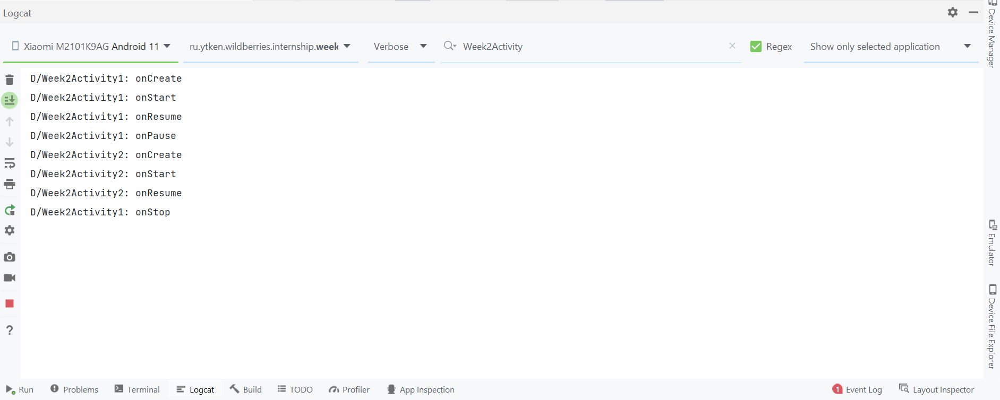
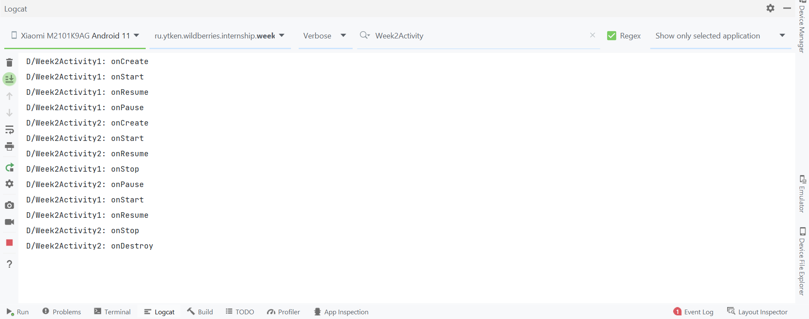
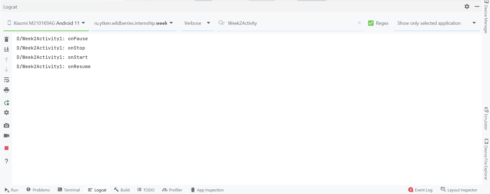

# Неделя 2. Жизненный цикл Activity
Изучим жизненный цикл Activity на практике.

Основные методы ЖЦ:

Название | Когда срабатывает
--- | ---
onCreate |	called when activity is first created.
onStart	| called when activity is becoming visible to the user.
onResume | called when activity will start interacting with the user.
onPause	| called when activity is not visible to the user.
onStop | called when activity is no longer visible to the user.
onRestart | called after your activity is stopped, prior to start.
onDestroy	| called before the activity is destroyed.

Приложение состоит из 2 Activity, одна открывается из другой по кнопке. Во второй по кнопке открывается AlertDialog.

1. Приложение открылось, произведен переход на второй экран и открытие AlertDialog

2. Произведен переход обратно на первый экран

3. Устройство заблокировано (произведена предварительная чистка логов)

