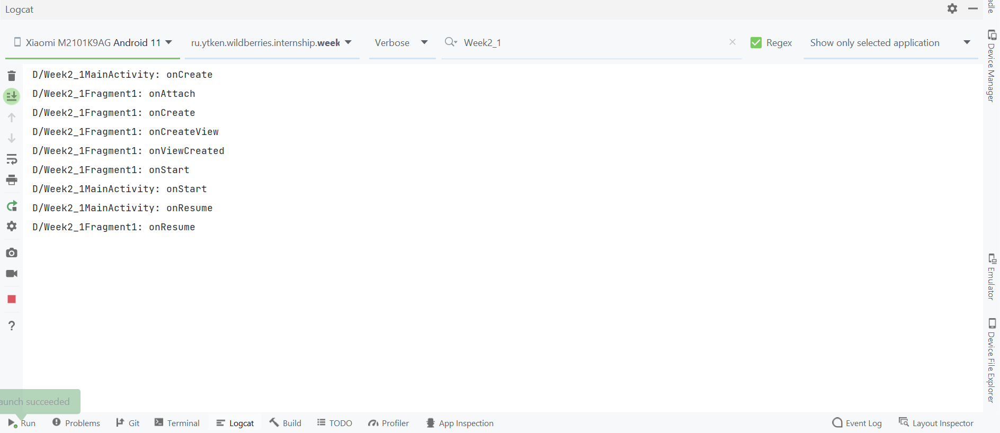
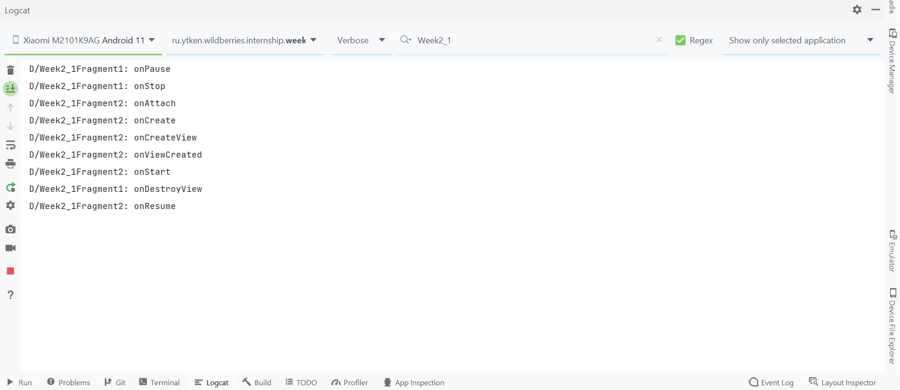
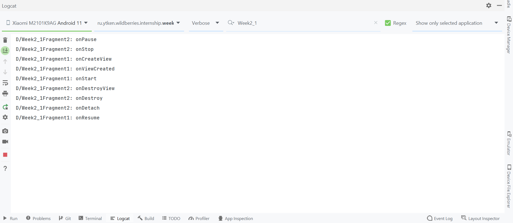
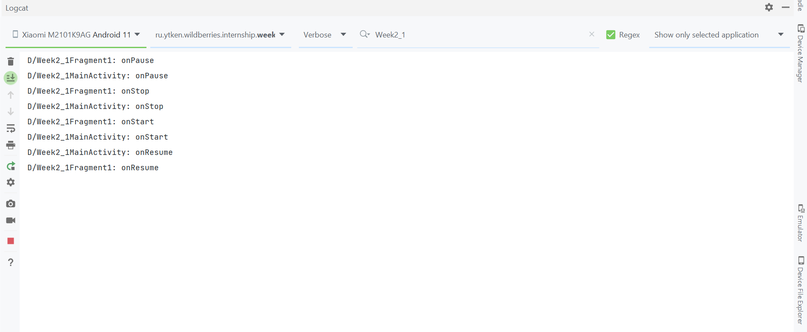
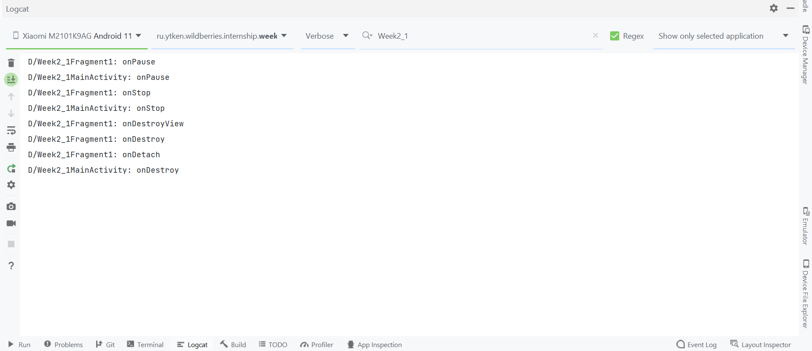

# Неделя 2. Жизненный цикл Fragment
## Теория

Изучим жизненный цикл Fragment и сравним его с ЖЦ Activity.

Основные методы ЖЦ Fragment:

Название | Когда вызывается | Особенности
--- | --- | ---
onAttach(Activity) | Когда фрагмент связывается с активностью. | С этого момента мы можем получить ссылку на активность через метод getActivity()
onCreate() | После onAttach() | В этом методе можно сделать работу, не связанную с интерфейсом. Например, подготовить адаптер.
onCreateView(LayoutInflater, ViewGroup, Bundle) | Один раз, когда фрагмент должен загрузить на экран свой интерфейс | Вызывается для создания компонентов внутри фрагмента
onViewCreated() | Сразу после onCreateView() | Можно обратиться к компонентам UI
onActivityCreated(Bundle) | Когда отработает метод активности onCreate() | **Deprecated** фрагмент может обратиться к компонентам активности
onStart() | После onCreateView()| Фрагмент видим для пользователя
onResume() | Вместе с onResume() активности | 
onPause() | Вместе с onPause() активности | 
onStop() | Вместе с onStop() активности | 
onDestroyView() | Когда набор компонентов удаляется из фрагмента | 
onDestroy() | Вместе с onDestroy() активности | 
onDetach() | Вместе с фрагмент отвязывается от активности | 

## Приложение

Приложение состоит из Activity и двух Fragment. Разметка Activity состоит из одного контейнера для фрагментов. Первый фрагмент содержит кнопку, по которой содержимое в контейнере меняется на второй фрагмент. Из второго фрагмента можно вернуться обратно на первый, либо открыть AlertDialog.

1. Приложение открылось

2. Переход ко второму фрагменту и открытие AlertDialog

3. Возвращение к первому фрагменту

4. Блокировка / разблокировка экрана

5. Выход из приложения

## Вывод

+ При наличии фрагмента на экране, происходит сначала вызов всех методов ЖЦ фрагмента до onStart(), затем вызов onStart() активности
+ Открытие AlertDialog не вызывает никаких методов ЖЦ
+ При смене фрагментов методом replace первый фрагмент вызывает onDestroyView() (разрушение UI), но при этом onDestroy() не вызывается
+ При смене фрагментов методом popBackStack() (удаление ссылки на фрагмент из backStack) происходит вызов всех методов разрушения второго фрагмента вплоть до onDetach()
+ При смене фрагментов никаких методов Activity не вызывается
+ При нахождении на экране Activity и Fragment большинство методов вызываются сначала у Fragment, затем у Activity (кроме onCreate() и onResume())

## Ответы на вопросы

1. Отличия жизненного цикла фрагмента от жизненного цикла активити. Для чего нужны эти отличия, почему они возникли?

По определению с сайта developer.android.com: A Fragment represents a reusable portion of your app's UI. Fragments cannot live on their own--they must be hosted by an activity or another fragment.

Некоторые отличия объясняются тем, что фрагменты не могут существовать сами по себе, они всегда должны быть привязаны к Activity: onAttach(), onDetach().

Остальные объясняются тем, что фрагменты более легковесны: например, при сохранении фрагмента в backStack уничтожается только его View, но не сам экземпляр.

2. Для чего нужен жизненный цикл и какие задачи можно с помощью него решать.

Жизненный цикл нужен для логичного и последовательного взаимодействия Activity с системой и внутри приложения. Это приводит к экономии ресурсов устройства, а также отказоустойчивости ОС.

3. 3 примера использования жизненного цикла в реальных приложениях.

+ отключение необходимых слушателей в onPause и их уничтожение в onStop для экономии ресурсов устройства (повсеместно, но чтобы понять точно нужно посмотреть код)
+ остановка некоторых процессов по необходимости (например приостановка музыки ВК без подписки когда приложение в фоне)
+ сбор информации о количестве времени, проведенном в приложении в активном и фоновом состояниях, а также на каждом из экранов (например Instagram)
